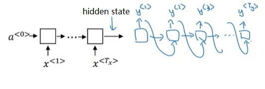
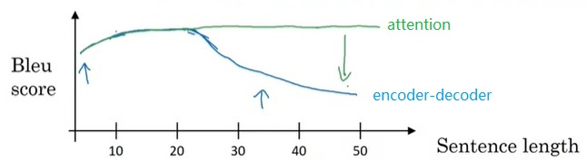
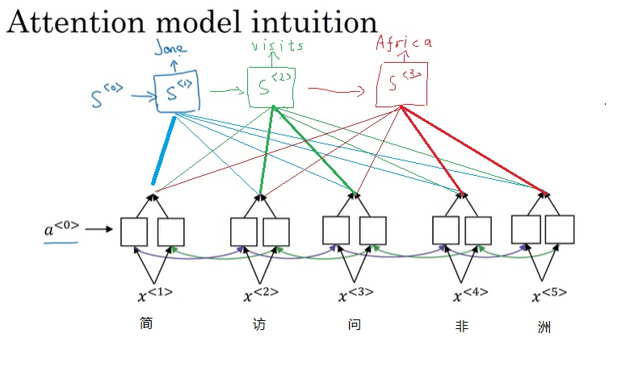
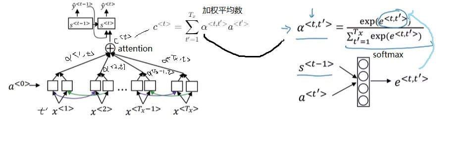

## PyTorch 注意力模型实现详解（以简单的机器翻译为例）
 
Transformer中的“注意力”最早来自于NLP里的注意力模型。通过动手实现一遍注意力模型，我们能够更深刻地理解注意力的原理，以便于学习Transformer等后续那些基于注意力的模型。在这篇文章中，我将分享如何用PyTorch的基本API实现注意力模型，完成一个简单的机器翻译项目——把各种格式的日期“翻译”成统一格式的日期。

有关机器翻译、注意力模型相关知识请参考我之前的文章。如序列模型与注意力机制。

项目网址：https://github.com/SingleZombie/DL-Demos/tree/master/dldemos/attention

### 知识背景
注意力模型发源自机器翻译任务。最早，基于RNN的机器翻译模型都采用如下的架构：



前半部分的RNN只有输入，后半部分的RNN只有输出。两个部分通过一个简单的隐状态来传递信息。把隐状态看成输入信息的一种编码的话，前半部分可以叫做“编码器”，后半部分可以叫做“解码器”。这种架构因而被称为“编码器-解码器”架构。

这种架构在翻译短句子时确实有效，但面对长文章时就捉襟见肘了。使用“编码器-解码器”架构时，无论输入有多长，输入都会被压缩成一个简短的编码。也就是说，模型要一次性阅读完所有输入，再一次性输出所有翻译。这显然不是一种好的方法。联想一下，我们人类在翻译时，一般会读一句话，翻译一句话，读一句话，翻译一句话。基于这种思想，有人提出了注意力模型。注意力模型能够有效地翻译长文章。



在注意力模型中，编码器和解码器以另一种方式连接在一起。在完成编码后，解码器会以不同的权重去各个编码输出中取出相关信息，也就是以不同的“注意力”去关注输入信息。



具体来说，注意力模型的结构如下。



对于每一轮的输出
，它的解码RNN的输入由上一轮输出
和注意力上下文
拼接而成。注意力上下文
，就是所有输入的编码RNN的隐变量
的一个加权平均数。这里加权平均数的权重
就是该输出对每一个输入的注意力。每一个
由编码RNN本轮状态
和解码RNN上一轮状态
决定。这两个输入会被送入一个简单的全连接网络，输出权重
（一个实数）。所有输入元素的
经过一个softmax输出
。

日期翻译任务及其数据集
为了简化项目的实现，我们来完成一个简单的日期翻译任务。在这个任务中，输入是各式各样的日期，输出是某一个标准格式的日期。比如：

| **input** | **output** |
| --- | --- |
| Nov 23, 1999 | 1999-11-23 |
| 3 April 2005 | 2005-04-03 |
| 14/01/1989 | 1989-01-14 |
| Thursday, February 7, 1985 | 1985-02-07 |
我们可以自己动手用`Python`生成数据集。在生成数据集时，我们要用到随机生成日期的`faker`库和格式化日期的`babel`库。

```bash
pip install faker babel
```
运行下面这段代码，我们可以生成不同格式的日期。
```python
import random

from babel.dates import format_date
from faker import Faker

faker = Faker()
format_list = [
    'short', 'medium', 'long', 'full', 'd MMM YYY', 'd MMMM YYY', 'dd/MM/YYY',
    'dd-MM-YYY', 'EE d, MMM YYY', 'EEEE d, MMMM YYY'
]

if __name__ == '__main__':
    for format in format_list:
        date_obj = faker.date_object()
        print(f'{format}:', date_obj,
              format_date(date_obj, format=format, locale='en'))
```
```text
Possible output:
short: 1986-02-25 2/25/86
medium: 1979-08-05 Aug 5, 1979
long: 1971-12-15 December 15, 1971
full: 2017-02-14 Tuesday, February 14, 2017
d MMM YYY: 1984-02-21 21 Feb 1984
d MMMM YYY: 2011-06-22 22 June 2011
dd/MM/YYY: 1991-08-02 02/08/1991
dd-MM-YYY: 1987-06-12 12-06-1987
EE d, MMM YYY: 1986-11-02 Sun 2, Nov 1986
EEEE d, MMMM YYY: 1996-01-26 Friday 26, January 1996
```
`Faker()`是生成随机数据的代理类，用它的`date_object()`方法可以随机生成一个日期字符串`date_obj`。这个日期就是我们期望的标准格式。而通过使用`format_date`函数，我们可以通过改变该函数的`format`参数来得到格式不一样的日期字符串。各种格式的日期示例可以参考上面的输出。

利用这些工具函数，我们可以编写下面这些生成、读取数据集的函数。
```python
def generate_date():
    format = random.choice(format_list)
    date_obj = faker.date_object()
    formated_date = format_date(date_obj, format=format, locale='en')
    return formated_date, date_obj


def generate_date_data(count, filename):
    with open(filename, 'w') as fp:
        for _ in range(count):
            formated_date, date_obj = generate_date()
            fp.write(f'{formated_date}\t{date_obj}\n')


def load_date_data(filename):
    with open(filename, 'r') as fp:
        lines = fp.readlines()
        return [line.strip('\n').split('\t') for line in lines]


generate_date_data(50000, 'dldemos/attention/train.txt')
generate_date_data(10000, 'dldemos/attention/test.txt')
```
注意力模型
在这个项目中，最难的部分是注意力模型的实现，即如何把上一节那个结构图用PyTorch描述出来。所有模型实现的代码如下：
```python
import torch
import torch.nn as nn
from torch.nn.utils.rnn import pad_sequence
from torch.utils.data import DataLoader, Dataset

from dldemos.attention.dataset import generate_date, load_date_data


EMBEDDING_LENGTH = 128
OUTPUT_LENGTH = 10

class AttentionModel(nn.Module):
    def __init__(self,
                 embeding_dim=32,
                 encoder_dim=32,
                 decoder_dim=32,
                 dropout_rate=0.5):
        super().__init__()
        self.drop = nn.Dropout(dropout_rate)
        self.embedding = nn.Embedding(EMBEDDING_LENGTH, embeding_dim)
        self.attention_linear = nn.Linear(2 * encoder_dim + decoder_dim, 1)
        self.softmax = nn.Softmax(-1)
        self.encoder = nn.LSTM(embeding_dim,
                               encoder_dim,
                               1,
                               batch_first=True,
                               bidirectional=True)
        self.decoder = nn.LSTM(EMBEDDING_LENGTH + 2 * encoder_dim,
                               decoder_dim,
                               1,
                               batch_first=True)
        self.output_linear = nn.Linear(decoder_dim, EMBEDDING_LENGTH)
        self.decoder_dim = decoder_dim

    def forward(self, x: torch.Tensor, n_output: int = OUTPUT_LENGTH):
        # x: [batch, n_sequence, EMBEDDING_LENGTH]
        batch, n_squence = x.shape[0:2]

        # x: [batch, n_sequence, embeding_dim]
        x = self.drop(self.embedding(x))

        # a: [batch, n_sequence, hidden]
        a, _ = self.encoder(x)

        # prev_s: [batch, n_squence=1, hidden]
        # prev_y: [batch, n_squence=1, EMBEDDING_LENGTH]
        # y: [batch, n_output, EMBEDDING_LENGTH]
        prev_s = x.new_zeros(batch, 1, self.decoder_dim)
        prev_y = x.new_zeros(batch, 1, EMBEDDING_LENGTH)
        y = x.new_empty(batch, n_output, EMBEDDING_LENGTH)
        tmp_states = None
        for i_output in range(n_output):
            # repeat_s: [batch, n_squence, hidden]
            repeat_s = prev_s.repeat(1, n_squence, 1)
            # attention_input: [batch * n_sequence, hidden_s + hidden_a]
            attention_input = torch.cat((repeat_s, a),
                                        2).reshape(batch * n_squence, -1)
            alpha = self.softmax(self.attention_linear(attention_input))
            c = torch.sum(a * alpha.reshape(batch, n_squence, 1), 1)
            c = c.unsqueeze(1)
            decoder_input = torch.cat((prev_y, c), 2)

            if tmp_states is None:
                prev_s, tmp_states = self.decoder(decoder_input)
            else:
                prev_s, tmp_states = self.decoder(decoder_input, tmp_states)

            prev_y = self.output_linear(prev_s)
            y[:, i_output] = prev_y.squeeze(1)
        return y
```
让我们把这份实现一点一点过一遍。

在实现前，我们要准备一些常量。我们首先要决定“词汇表”的大小。在日期翻译任务中，输入和输出应当看成是字符序列。字符最多有128个，因此我们可以令“词汇表”大小为128。

`EMBEDDING_LENGTH = 128`

在我们这个任务中，输出序列的长度是固定的。对于yyyy-mm-dd这个日期字符串，其长度为10。我们要把这个常量也准备好。

`OUTPUT_LENGTH = 10`

接下来是模型的实现。先看__init__里的结构定义。一开始，按照RNN模型的惯例，我们要让输入过Dropout和嵌入层。对于单词序列，使用预训练的单词嵌入会好一点。然而，我们这个项目用的是字符序列，直接定义一个可学习的嵌入层即可。
```python
self.drop = nn.Dropout(dropout_rate)
self.embedding = nn.Embedding(EMBEDDING_LENGTH, embeding_dim)
```
接下来是编码器和解码器。在注意力模型中，编码器和解码器是两个不同的RNN。为了充分利用输入信息，可以把双向RNN当作编码器。而由于机器翻译是一个生成答案的任务，每轮生成元素时需要用到上一轮生成出来的元素，解码器必须是一个单向RNN。在本项目中，我使用的RNN是LSTM。模块定义代码如下：
```python
self.encoder = nn.LSTM(embeding_dim,
                        encoder_dim,
                        1,
                        batch_first=True,
                        bidirectional=True)
self.decoder = nn.LSTM(EMBEDDING_LENGTH + 2 * encoder_dim,
                        decoder_dim,
                        1,
                        batch_first=True)     
```
这里要注意一下这两个模块的输入通道数。encoder的输入来自嵌入层，因此是embeding_dim，这个很好理解。decoder的输入通道则需要计算一番了。decoder的输入由模型上一轮的输出和注意力输出拼接而成。模型每轮会输出一个字符，字符的通道数是“词汇表”大小，即`EMBEDDING_LENGTH`。注意力的输出是encoder的隐变量的加权和，因此其通道数和encoder的隐变量一致。encoder是双向RNN，其隐变量的通道数是`2 * encoder_dim`。最终，decoder的输入通道数应是`EMBEDDING_LENGTH + 2 * encoder_dim`。

在注意力模块中，解码RNN对各编码RNN的注意力由一个线性层计算而得。该线性层的输入由解码RNN和编码RNN的隐变量拼接而成，因此其通道数为`2 * encoder_dim + decoder_dim`；该线性层的输出是注意力权重——一个实数。
```python
self.attention_linear = nn.Linear(2 * encoder_dim + decoder_dim, 1)
```
解码结束后，还需要经过一个线性层才能输出结果。
```python
self.output_linear = nn.Linear(decoder_dim, EMBEDDING_LENGTH)
```

看完了__init__，来看看forward里各模块是怎么连接起来的。

机器翻译其实是一个生成序列的任务。一般情况下，生成序列的长度是不确定的，需要用一些额外的技巧来选择最佳的输出序列。为了简化实现，在这个项目中，我们生成一个固定长度的输出序列。该长度应该在forward的参数里指定。因此，forward的参数如下：
```python
def forward(self, x: torch.Tensor, n_output: int = OUTPUT_LENGTH):
```
一开始，先获取一些形状信息。
```python
# x: [batch, n_sequence, EMBEDDING_LENGTH]
batch, n_squence = x.shape[0:2]
```
输入通过嵌入层和dropout层。
```python
# x: [batch, n_sequence, embeding_dim]
x = self.drop(self.embedding(x))
```
再通过编码器，得到编码隐状态a。
```python
# a: [batch, n_sequence, hidden]
a, _ = self.encoder(x)
```
接下来，要用for循环输出每一轮的结果了。在此之前，我们要准备一些中间变量：用于计算注意力的解码器上一轮状态prev_s，用于解码器输入的上一轮输出prev_y，输出张量y。另外，由于我们要在循环中手动调用decoder完成每一轮的计算，还需要保存decoder的所有中间变量tmp_states。
```python
# prev_s: [batch, n_squence=1, hidden]
# prev_y: [batch, n_squence=1, EMBEDDING_LENGTH]
# y: [batch, n_output, EMBEDDING_LENGTH]
prev_s = x.new_zeros(batch, 1, self.decoder_dim)
prev_y = x.new_zeros(batch, 1, EMBEDDING_LENGTH)
y = x.new_empty(batch, n_output, EMBEDDING_LENGTH)
tmp_states = None
```
在每一轮输出中，我们首先要获得当前的解码器对于每一个输入的注意力alpha。每一个alpha由解码器上一轮状态prev_s和编码器本轮状态决定（一个全连接层+softmax）。为了充分利用并行计算，我们可以把所有alpha的计算打包成batch，一步做完。


_注意，这里的全连接层+softmax和普通的全连接网络不太一样。这里全连接层的输出通道数是1，会对n组输入做n次计算，得到n个结果，再对n个结果做softmax。我们之所以能一次得到n个结果，是巧妙地把n放到了batch那一维。_
```python
for i_output in range(n_output):
    # repeat_s: [batch, n_squence, hidden]
    repeat_s = prev_s.repeat(1, n_squence, 1)
    # attention_input: [batch * n_sequence, hidden_s + hidden_a]
    attention_input = torch.cat((repeat_s, a),
                                2).reshape(batch * n_squence, -1)
    # x: [batch * n_sequence, 1]
    x = self.attention_linear(attention_input)
    # x: [batch, n_sequence]
    x = x.reshape(batch, n_squence)
    alpha = self.softmax(x)
```
求出了注意力alpha后，就可以用它来算出注意力上下文c了。
```python
c = torch.sum(a * alpha.reshape(batch, n_squence, 1), 1)
```
之后，我们把c和上一轮输出prev_y拼一下，作为解码器的输出。
```python
c = c.unsqueeze(1)
decoder_input = torch.cat((prev_y, c), 2)
```
再调用解码器即可。这里我利用PyTorch的机制偷了个懒。理论上解码器第一轮的状态应该是全零张量，我们应该初始化两个全零张量作为LSTM的初始状态。但是，在PyTorch里，如果调用RNN时不传入状态，就默认会使用全零状态。因此，在第一轮调用时，我们可以不去传状态参数。
```python
if tmp_states is None:
    prev_s, tmp_states = self.decoder(decoder_input)
else:
    prev_s, tmp_states = self.decoder(decoder_input, tmp_states)
```
最后，用线性层算出这轮的输出，维护输出变量y。循环结束后，返回y。
```python
    prev_y = self.output_linear(prev_s)
    y[:, i_output] = prev_y.squeeze(1)

return y
```
训练、测试、推理
写完了最核心的注意力模型，剩下的代码就比较简单了。

首先，我们要准备一个Dataset类。这个类可以读取输入、输出字符串，并把它们转换成整形数组。字符和整形数字间的映射非常暴力，一个字符的序号就是该字符的ASCII码。这样写比较简洁，但由于很多字符是用不到的，会浪费一些计算性能。
```python
def stoi(str):
    return torch.LongTensor([ord(char) for char in str])


def itos(arr):
    return ''.join([chr(x) for x in arr])


class DateDataset(Dataset):
    def __init__(self, lines):
        self.lines = lines

    def __len__(self):
        return len(self.lines)

    def __getitem__(self, index):
        line = self.lines[index]

        return stoi(line[0]), stoi(line[1])
```
准备好DataSet后，就可以生成DataLoader了。在序列任务中，各个样本的序列长度可能是不一致的。我们可以用PyTorch的pad_sequence对长度不足的样本进行0填充，使得一个batch里的所有样本都有着同样的序列长度。
```python
def get_dataloader(filename):

    def collate_fn(batch):
        x, y = zip(*batch)
        x_pad = pad_sequence(x, batch_first=True)
        y_pad = pad_sequence(y, batch_first=True)
        return x_pad, y_pad

    lines = load_date_data(filename)
    dataset = DateDataset(lines)
    return DataLoader(dataset, 32, collate_fn=collate_fn)
```
这里要稍微注意一下，pad_sequence默认会做0填充，0填充在我们的项目里是合理的。在我们定义的“词汇表”里，0对应的是ASCII里的0号字符，这个字符不会和其他字符起冲突。

做好一切准备工作后，可以开始训练模型了。训练模型的代码非常常规，定义好Adam优化器、交叉熵误差，跑完模型后reshape一下算出loss再反向传播即可。
```
def main():
    device = 'cuda:0'
    train_dataloader = get_dataloader('dldemos/attention/train.txt')
    test_dataloader = get_dataloader('dldemos/attention/test.txt')

    model = AttentionModel().to(device)

    # train

    optimizer = torch.optim.Adam(model.parameters(), lr=0.001)
    citerion = torch.nn.CrossEntropyLoss()
    for epoch in range(20):

        loss_sum = 0
        dataset_len = len(train_dataloader.dataset)

        for x, y in train_dataloader:
            x = x.to(device)
            y = y.to(device)
            hat_y = model(x)
            n, Tx, _ = hat_y.shape
            hat_y = torch.reshape(hat_y, (n * Tx, -1))
            label_y = torch.reshape(y, (n * Tx, ))
            loss = citerion(hat_y, label_y)

            optimizer.zero_grad()
            loss.backward()
            torch.nn.utils.clip_grad_norm_(model.parameters(), 0.5)
            optimizer.step()

            loss_sum += loss * n

        print(f'Epoch {epoch}. loss: {loss_sum / dataset_len}')

    torch.save(model.state_dict(), 'dldemos/attention/model.pth')
```
训练完模型后，我们可以测试一下模型在测试集上的正确率。在日期翻译任务中，我们可以把“正确”定义为输出和真值一模一样。比如一条日期的真值是”2000-01-01”，模型的输出必须也是”2000-01-01”才能说这个输出是正确的。编写并行化计算正确率的代码稍有难度。

模型的输出hat_y表示各个字符的出现概率。我们先用`prediction = torch.argmax(hat_y, 2)`把序列里每个概率最大的字符作为模型预测的字符。现在，我们要用并行化编程判断每对序列（整形标签数组）predition[i]和y[i]是否相等（注意，predition和y是带了batch那个维度的）。这里，我们可以让predition[i]和y[i]做减法再求和。仅当这个和为0时，我们才能说predition[i]和y[i]完全相等。通过这样一种曲折的实现方法，我们可以并行地算出正确率。

也许有更方便的API可以完成这个逻辑判断，但去网上搜索这么复杂的一个需求太麻烦了，我偷了个懒。
```python
# test
model.load_state_dict(torch.load('dldemos/attention/model.pth'))

accuracy = 0
dataset_len = len(test_dataloader.dataset)

for x, y in test_dataloader:
    x = x.to(device)
    y = y.to(device)
    hat_y = model(x)
    prediction = torch.argmax(hat_y, 2)
    score = torch.where(torch.sum(prediction - y, -1) == 0, 1, 0)
    accuracy += torch.sum(score)

print(f'Accuracy: {accuracy / dataset_len}')
```
最后，我们也可以临时生成几个测试用例，输出模型的预测结果。
```python
# inference
for _ in range(5):
    x, y = generate_date()
    origin_x = x
    x = stoi(x).unsqueeze(0).to(device)
    hat_y = model(x)
    hat_y = hat_y.squeeze(0).argmax(1)
    hat_y = itos(hat_y)
    print(f'input: {origin_x}, prediction: {hat_y}, gt: {y}')
```
训练20-30个epoch后，模型差不多就收敛了。我训练的模型在测试集上的正确率约有98%。下面是随机测试用例的推理结果，可以看出模型的判断确实很准确。
```text
input: 4 November 1988, prediction: 1988-11-04, gt: 1988-11-04
input: Friday 26, March 2021, prediction: 2021-03-26, gt: 2021-03-26
input: Saturday 2, December 1989, prediction: 1989-12-02, gt: 1989-12-02
input: 15/10/1971, prediction: 1971-10-15, gt: 1971-10-15
input: Mon 9, Oct 1989, prediction: 1989-10-09, gt: 1989-10-09
```
### 总结
在这篇文章中，我展示了一个用PyTorch编写的注意力模型，它用于完成日期翻译任务。在这个项目中，最重要的是注意力模型的编写。如今，注意力模型已经不是功能最强大的模型架构了。不过，通过动手实现这个模型，我们可以对注意力机制有着更深刻的认识，有助于理解那些更先进的模型。