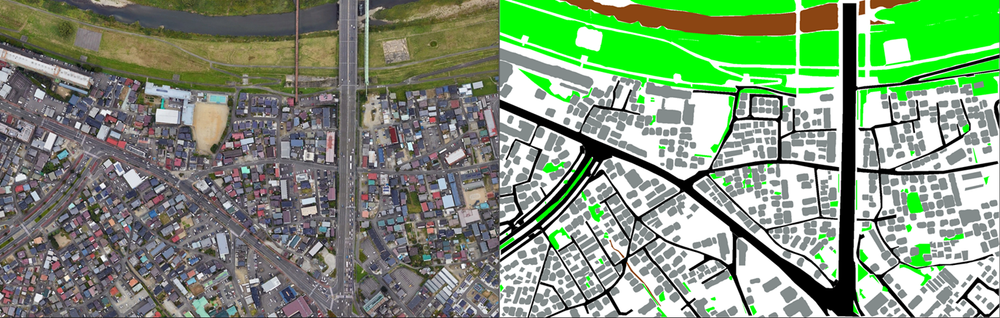
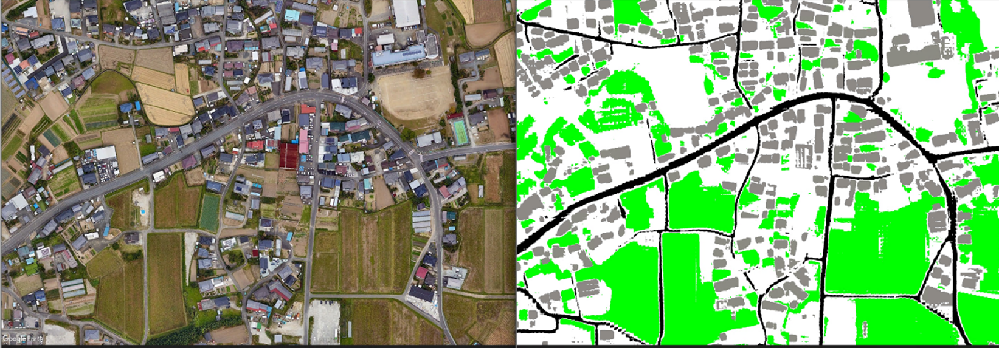

# Semantic Segmentation of Satellite Images for Disaster Road Detection Using Vision Transformer

## Project Overview
This project focuses on semantic segmentation of satellite images to identify roads, vegetation, and other features. It aims to assess road accessibility after disasters and facilitate optimal route planning. By leveraging state-of-the-art deep learning models and data preprocessing techniques, the project achieves efficient pixel-level segmentation.

### Dataset and Preprocessing

1. **Data Source**
    - The original dataset includes four groups of satellite images with a training-to-validation split ratio of 4:1.
2. **Data Annotation**
    - Utilized **ISAT** (Interactive Semantic Annotation Tool) and **Segment Anything** for image annotation.
    - ISAT's interactive interface, combined with Segment Anything's generalized segmentation capabilities, produced high-quality labels efficiently.
   
   

3. **Data Augmentation**
    - Applied segmentation, translation, rotation, and flipping techniques to augment the original dataset.
    - Expanded the dataset from 4 groups to 10,000 groups, significantly enhancing model generalization and adaptability to diverse scenarios.
4. **Data Preprocessing**
    - **Image and Label Loading**: Images and their corresponding labels (in grayscale) were loaded using OpenCV.
    - **Random Cropping**: Augmented images were cropped into smaller patches for training, saved in PNG format, and recorded in a CSV file.

### Model Architecture

1. **Vision Transformer (ViT)**
    - Employed the pre-trained ViT-L/14 model as the feature extractor.
    - ViT captures global dependencies within images through self-attention mechanisms, processing the input as 14×14 image patches for detailed representation.
2. **Custom Segmentation Model (MyModelSeg)**
    - Built on top of ViT with added convolutional layers, upsampling layers, and ReLU activation functions.
    - Upsampling layers restored the original image resolution, ensuring accurate pixel-level classification.

### Training Methodology

- **Optimizer**: AdamW optimizer was used to address weight decay and improve convergence speed.
- **Loss Function**: Dice coefficient was selected for its effectiveness in handling class imbalance and suitability for pixel-level tasks.
- **Learning Rate Scheduling**: A LinearLR scheduler gradually reduced the learning rate, stabilizing convergence in later stages.
- **Training Configuration**: Batch size of 32, GPU: 4090D, Memory: 24G. Training duration: 3 hours with 20,000 iterations.

### Project Outcomes

- **Segmentation Accuracy**: Achieved 82.65% accuracy.
- **Application Performance**:
    - Roads and vegetation were accurately segmented.
    - Most vehicles on roads were successfully detected and marked in white.

### Technical Highlights

- Incorporated **ISAT** and **Segment Anything** tools, dramatically improving annotation efficiency and quality.
- Expanded the dataset to 10,000 groups using various augmentation techniques (segmentation, translation, rotation, flipping).
- Combined Vision Transformer and custom upsampling techniques for efficient satellite image segmentation.
- Addressed critical disaster management needs by enabling rapid road accessibility assessment.

