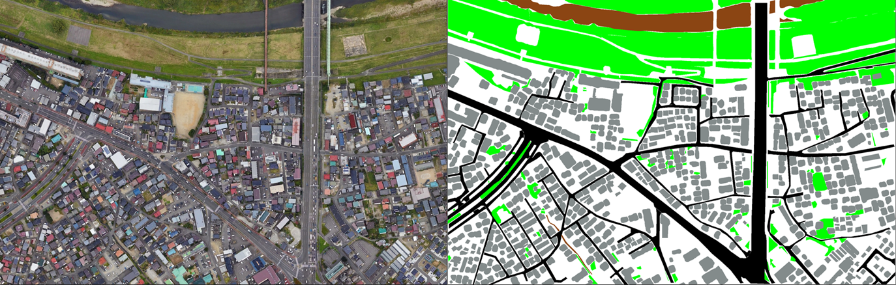

# Vision Transformer-Based Semantic Segmentation of Satellite Imagery with LoRA Fine-Tuning

## Overview

This project performs pixel-level semantic segmentation on high-resolution satellite imagery to identify roads, vegetation, buildings, and vehicles — with applications in post-disaster road assessment and optimal route planning. It combines the global modeling capability of Vision Transformer with LoRA (Low-Rank Adaptation) for parameter-efficient fine-tuning, achieving high accuracy while significantly reducing training cost.

## Dataset & Preprocessing

- **Source:** 4 high-resolution satellite image groups, split 4:1 for training/validation.
- **Annotation:** [ISAT (Interactive Semantic Annotation Tool)](https://github.com/yatengLG/ISAT_with_segment_anything) + Segment Anything for efficient, high-quality labeling.
- **Augmentation:** Random cropping, translation, rotation, flipping, and color jittering — expanding from 4 samples to **10,000 training pairs**.
- **Pipeline:** OpenCV-based automated loading, patch generation, and CSV indexing.

## Model Architecture

### Backbone: ViT-L/14 + LoRA

Pretrained ViT-L/14 as the feature extractor, with LoRA injected into the Attention Q and V layers:

$$W' = W + AB, \quad A \in \mathbb{R}^{d \times r},\ B \in \mathbb{R}^{r \times d},\ r \ll d$$

This reduces trainable parameters by over 90% while preserving pretrained representations.

### Decoder: MyModelSeg

A lightweight decoder on top of ViT features:
- Token-to-feature-map reshape
- Convolutional layers + upsampling + ReLU
- Restores spatial resolution for pixel-level prediction

### Inference

Sliding window strategy for high-resolution images to avoid memory overflow while maintaining spatial consistency.

## Training Configuration

| Parameter | Value |
|-----------|-------|
| Optimizer | AdamW |
| Loss | Dice Loss |
| LR Schedule | LinearLR |
| Batch Size | 32 |
| GPU | RTX 4090D (24GB) |
| Iterations | 20,000 |
| Training Time | ~3 hours |

## Results

**Overall Accuracy: 82.65%**

The model successfully segments roads, vegetation, building outlines, and vehicles. In post-disaster scenarios, it can quickly identify passable vs. blocked road sections.

## Showcase

Label data used for training:

Training results:

## Applications

- Post-disaster emergency route planning
- Urban traffic recovery analysis
- Disaster assessment systems
- Smart city remote sensing monitoring
