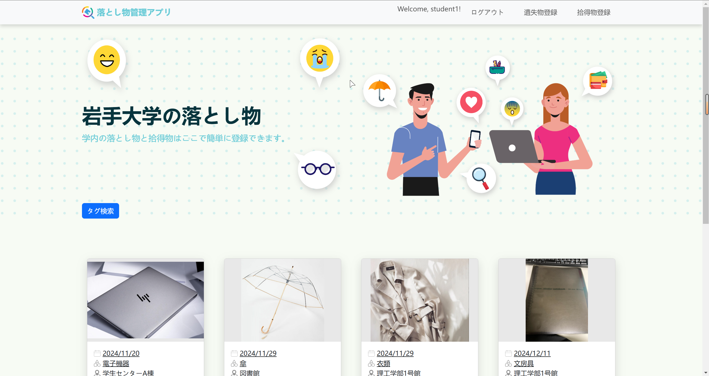

# Iwate University Lost Items System

## System display

### pages

### QRcode login

### Project Overview

This project aims to design and develop an efficient lost and found management system for Iwate University. It facilitates the registration and search for lost and found items by students and administrators, significantly improving recovery efficiency while reducing administrative workload.

### Key Features

1. **Homepage (top)**
    - Initial screen for searching lost items.
    - Features include keyword search, filtering options, and pagination (under development).
2. **Found Item Registration Module (founditem)**
    - **Completed Features**:
        - Students can register found items.
    - **Pending Features**:
        - Administrator (university staff) login functionality.
        - After registration, students scan the administrator's QR code to complete detailed found item records.
3. **Lost Item Registration Module (lostitem)**
    - **Completed Features**:
        - Students can log in and register lost items.
        - Email notification system: Sends a verification link for account activation during registration. Periodically checks the database for matching items and notifies users of found items via email.
    - **Pending Features**:
        - Allow users to delete registered lost item information.

### Technical Implementation

1. **Development Framework**
    - Built with **Python** and the **Django** framework.
2. **Backend Database**
    - Uses **MySQL** to store user information and item data, ensuring reliable and efficient data management.
3. **Message Queue and Scheduled Tasks**
    - **Redis** is utilized for message queuing and supports scheduled tasks.
    - Enables timely email notifications to users with matching lost and found items.
4. **User Registration and Security**
    - A secure account activation mechanism where users must click the verification link sent to their email to activate their account.
5. **Scalability**
    - The system is designed for future expansion, such as adding advanced search filters and admin-specific functionalities.

### Project Progress

- Basic registration and interaction functions for lost and found items have been completed.
- Email notification and scheduled task functionalities are fully operational, improving matching efficiency.
- Advanced homepage search features and admin-side functionalities are under development.

### Technical Highlights

- Utilized **Redis** for efficient message queuing and scheduling, enabling timely email notifications.
- Implemented a secure user account activation process to ensure system reliability and security.
- Built on **Django** and **MySQL**, providing a stable backend for robust data handling.
- The email notification system optimizes the matching process between lost and found items, assisting users in quickly recovering their belongings.